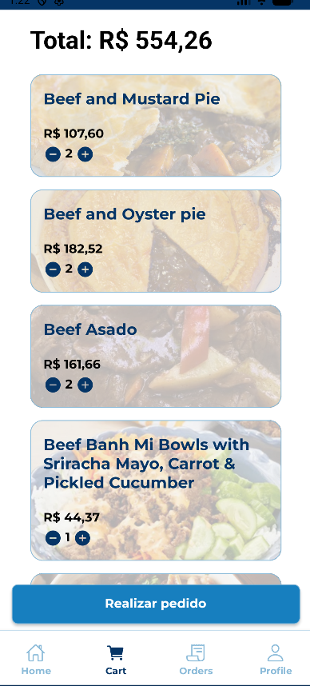
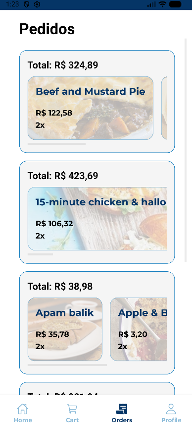

# 🍔 InfnetFood

Aplicativo desenvolvido em **React Native** com **Expo** para gerenciamento e exibição de produtos de categorias de um aplicativo de delivery fictício.  
O projeto possui funcionalidades como listagem de produtos, carrinho de compras persistente e navegação entre telas.

---

## 📱 Tecnologias Utilizadas

- [React Native](https://reactnative.dev/) (`0.81.4`)
- [Expo](https://expo.dev/) (`~54.0.10`)
- [React Navigation](https://reactnavigation.org/)
  - `@react-navigation/native`
  - `@react-navigation/bottom-tabs`
  - `@react-navigation/drawer`
  - `@react-navigation/material-top-tabs`
  - `@react-navigation/native-stack`
- [Styled-components](https://styled-components.com/) (`^6.1.19`)
- [AsyncStorage](https://github.com/react-native-async-storage/async-storage) (`2.2.0`)
- [React Native Reanimated](https://docs.swmansion.com/react-native-reanimated/) (`~4.1.0`)
- [React Native Gesture Handler](https://docs.swmansion.com/react-native-gesture-handler/) (`~2.28.0`)
- [React Native Maps](https://github.com/react-native-maps/react-native-maps) (`1.20.1`)
- [React Native Toast Message](https://github.com/calintamas/react-native-toast-message) (`^2.3.3`)
- [Expo Google Fonts](https://github.com/expo/google-fonts) (`Montserrat`, `Roboto`)

---

## ⚙️ Pré-requisitos

- Node.js LTS (recomendado ≥ 18.x)
- [Expo CLI](https://docs.expo.dev/get-started/installation/) instalado globalmente:
  ```bash
  npm install -g expo-cli
  ```
- Android Studio (para emulação) ou dispositivo físico com Expo Go instalado.

## 🚀 Como rodar o projeto

- Clone o repositório:
  ```bash
  git clone https://github.com/DevMatheusMonteiro/InfnetFood.git
  ```
- Instale as dependências:

```bash
npm install
```

- Inicie o servidor de desenvolvimento:

```bash
npm start
```

- Para rodar no Android:

```bash
npm run android
```

- Para rodar no iOS (apenas macOS):

```bash
npm run ios
```

## 🛠️ Funcionalidades

- Listagem de categorias e produtos.
- Tela de detalhes de produtos.
- Carrinho de compras persistente com AsyncStorage.
- Toasts de feedback ao usuário.
- Navegação com abas (TabNavigator) e pilha (StackNavigator).
- Integração com TheMealDB API para buscar produtos fictícios.
- Mapa simulado com API do Google Maps

## 📸 Screenshots

- Página inicial:
  
- Carrinho de compras:
  
- Histórico de Pedidos:
  

## 👨‍💻 Autor

Desenvolvido por Matheus Monteiro como parte dos estudos em desenvolvimento mobile.
